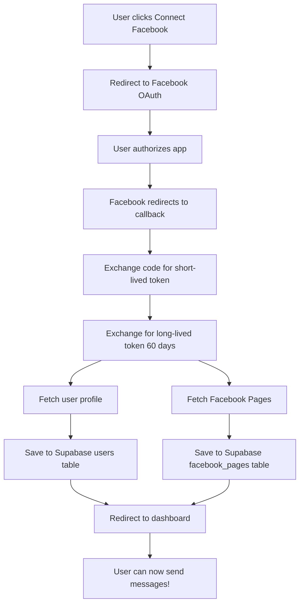

# 🎉 Facebook OAuth Auto-Token Generation - Implementation Complete!

## ✅ What Was Built

A complete Facebook OAuth system that **automatically generates long-lived tokens** (~60 days) for every user who connects their Facebook account.

---

## 📁 Files Created

### 🗄️ Database (1 file)
```
supabase/migrations/
└── add_facebook_oauth_tokens.sql       - Token storage schema + RLS policies
```

### 🔧 Backend - Configuration (2 files)
```
src/lib/facebook/
├── config.ts                           - OAuth URLs, App ID, scopes
└── token-manager.ts                    - Token exchange & management logic
```

### 🌐 Backend - API Routes (6 files)
```
src/app/api/
├── auth/facebook/
│   ├── route.ts                        - Initiate OAuth (GET /api/auth/facebook)
│   └── callback/route.ts               - OAuth callback handler
│
└── facebook/
    ├── refresh-token/route.ts          - POST /api/facebook/refresh-token
    ├── pages/route.ts                  - GET/POST /api/facebook/pages
    └── disconnect/route.ts             - POST /api/facebook/disconnect
```

### 🎨 Frontend - UI Components (2 files)
```
src/components/facebook/
├── connect-facebook-button.tsx         - Simple "Connect Facebook" button
└── facebook-connection-card.tsx        - Full connection management UI
```

### 📚 Documentation (5 files)
```
Project Root/
├── FACEBOOK_OAUTH_SETUP.md            - Complete setup guide
├── FACEBOOK_OAUTH_QUICKSTART.md       - 5-minute quick start
├── ENV_VARIABLES_GUIDE.md             - Environment variables reference
├── IMPLEMENTATION_SUMMARY.md          - This file
├── .env.example                       - Updated with Facebook vars
├── FB_TOKEN_README.md                 - Original manual token guide
└── QUICKSTART.md                      - Original manual token quick start
```

---

## 🔄 How It Works



---

## 🎯 Key Features

### ✅ Automatic Token Generation
- Short-lived → Long-lived token exchange (60 days)
- No manual token copying needed
- Token stored securely per-user

### ✅ Auto Page Syncing
- Fetches all Facebook Pages user manages
- Stores page-specific access tokens
- Updates follower counts

### ✅ Token Management
- Auto-refresh before expiry
- Token validation
- Graceful error handling

### ✅ Security
- Row Level Security (RLS) policies
- Tokens never exposed to client
- CSRF protection with state parameter

### ✅ Beautiful UI
- Pre-built React components
- Shows connection status
- Displays all pages
- Refresh & disconnect options

---

## 🔐 Environment Variables

### Required
```bash
NEXT_PUBLIC_FACEBOOK_APP_ID=802438925861067
FACEBOOK_APP_SECRET=99e11ff061cd03fa9348547f754f96b9
NEXT_PUBLIC_BASE_URL=http://localhost:3000
```

### Already Existing
```bash
NEXT_PUBLIC_SUPABASE_URL=...
NEXT_PUBLIC_SUPABASE_ANON_KEY=...
```

---

## 🗃️ Database Schema

### users table (additions)
```sql
facebook_access_token        TEXT       - Long-lived user token
facebook_token_expires_at    TIMESTAMPTZ - When token expires
facebook_token_updated_at    TIMESTAMPTZ - Last token update
```

### facebook_pages table (existing)
```sql
access_token                 TEXT       - Page-specific token
access_token_expires_at      TIMESTAMPTZ - Page token expiry (new)
```

---

## 🌐 API Endpoints

| Method | Endpoint | Description |
|--------|----------|-------------|
| GET | `/api/auth/facebook` | Initiate OAuth flow |
| GET | `/api/auth/facebook/callback` | Handle OAuth callback |
| POST | `/api/facebook/refresh-token` | Refresh expiring token |
| GET | `/api/facebook/pages` | Get user's pages |
| POST | `/api/facebook/pages` | Toggle/manage pages |
| POST | `/api/facebook/disconnect` | Disconnect Facebook |

---

## 💻 Usage Examples

### 1. Add Connection UI to Dashboard

```tsx
import { FacebookConnectionCard } from '@/components/facebook/facebook-connection-card';

export default function DashboardPage() {
  return (
    <div className="container py-8">
      <h1>Dashboard</h1>
      <FacebookConnectionCard />
    </div>
  );
}
```

### 2. Get User's Token in API Route

```tsx
import { createClient } from '@/lib/supabase/server';

export async function POST(request: Request) {
  const supabase = await createClient();
  
  const { data: { user } } = await supabase.auth.getUser();
  
  const { data } = await supabase
    .from('users')
    .select('facebook_access_token')
    .eq('id', user.id)
    .single();
  
  // Use data.facebook_access_token to call Facebook API
}
```

### 3. Post to Facebook Page

```tsx
// Get user's page token
const { data: page } = await supabase
  .from('facebook_pages')
  .select('access_token, facebook_page_id')
  .eq('user_id', userId)
  .eq('is_active', true)
  .single();

// Post to page
await fetch(`https://graph.facebook.com/v19.0/${page.facebook_page_id}/feed`, {
  method: 'POST',
  headers: { 'Content-Type': 'application/json' },
  body: JSON.stringify({
    message: 'Hello from my app!',
    access_token: page.access_token
  })
});
```

---

## 🚀 Setup Checklist

- [ ] Add environment variables to `.env.local`
- [ ] Run database migration in Supabase
- [ ] Configure Facebook App redirect URIs
- [ ] Add UI component to your dashboard
- [ ] Restart dev server
- [ ] Test OAuth flow
- [ ] Verify tokens in Supabase

---

## 📊 Benefits

### Before (Manual)
- ❌ Admin generates token manually
- ❌ Copy/paste to each user
- ❌ Token expires in 60 days
- ❌ Manual refresh needed
- ❌ Single token for all users
- ❌ Security concerns

### After (Automatic) ✅
- ✅ Users generate own tokens
- ✅ One-click OAuth
- ✅ Auto-refresh before expiry
- ✅ Per-user tokens
- ✅ Secure storage
- ✅ Full audit trail

---

## 🎓 Technical Details

### OAuth Flow
1. User clicks "Connect Facebook"
2. Redirect to Facebook with `client_id`, `redirect_uri`, `scope`
3. User authorizes
4. Facebook redirects to callback with `code`
5. Exchange `code` for short-lived token
6. Exchange short-lived for long-lived token
7. Store token + fetch pages
8. Redirect back to app

### Token Lifecycle
- **Short-lived**: 1-2 hours
- **Long-lived**: ~60 days
- **Page tokens**: Long-lived, derived from user token
- **Refresh**: Automatically before expiry

### Security Measures
- RLS policies on database tables
- Tokens stored server-side only
- CSRF protection via state parameter
- HTTPS required in production
- Environment variables for secrets

---

## 🐛 Troubleshooting

| Error | Solution |
|-------|----------|
| "Redirect URI mismatch" | Add callback URL in Facebook settings |
| "Invalid Client ID" | Check `NEXT_PUBLIC_FACEBOOK_APP_ID` |
| "No token found" | User needs to connect Facebook first |
| "Token expired" | Call `/api/facebook/refresh-token` |
| "No pages found" | User must be admin of Facebook Pages |

---

## 📚 Next Steps

1. **For Production:**
   - Update `NEXT_PUBLIC_BASE_URL` to your domain
   - Add production redirect URI to Facebook App
   - Deploy environment variables to hosting platform

2. **Integrate with Messaging:**
   - Use tokens from database in your bulk send logic
   - Implement token refresh before long operations
   - Add error handling for expired tokens

3. **Monitoring:**
   - Track token usage
   - Monitor expiry dates
   - Alert users before token expires

---

## 🎉 Success!

You now have a complete, production-ready Facebook OAuth system that automatically generates and manages long-lived tokens for all your users!

**Every user gets their own secure, long-lived Facebook token with zero manual work.**

---

## 📞 Files to Reference

- **Setup Instructions**: `FACEBOOK_OAUTH_SETUP.md`
- **Quick Start**: `FACEBOOK_OAUTH_QUICKSTART.md`
- **Environment Vars**: `ENV_VARIABLES_GUIDE.md`
- **Original Manual Tool**: `FB_TOKEN_README.md` (still works!)

---

**Built with ❤️ for automatic Facebook token management**
