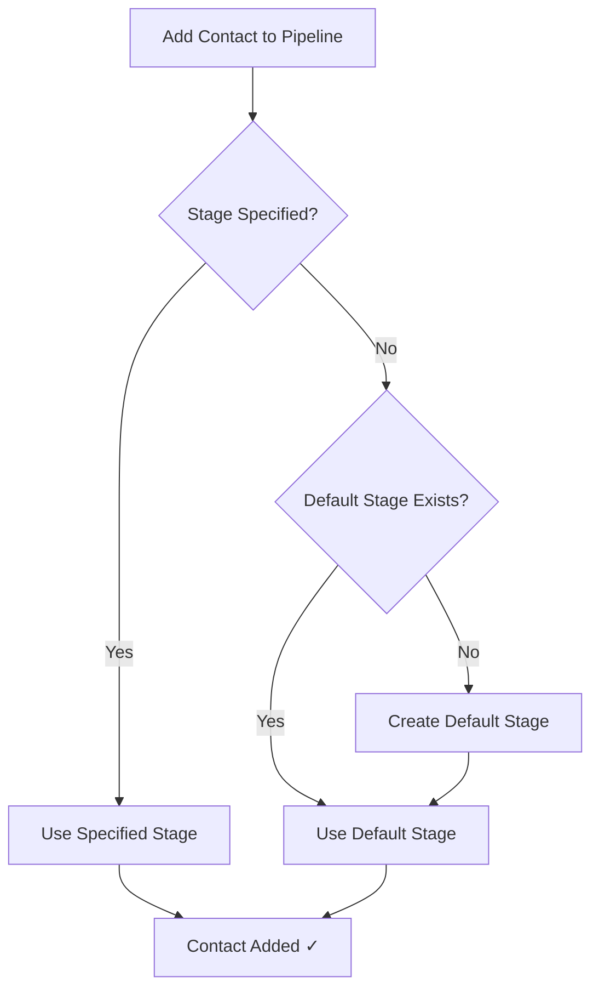
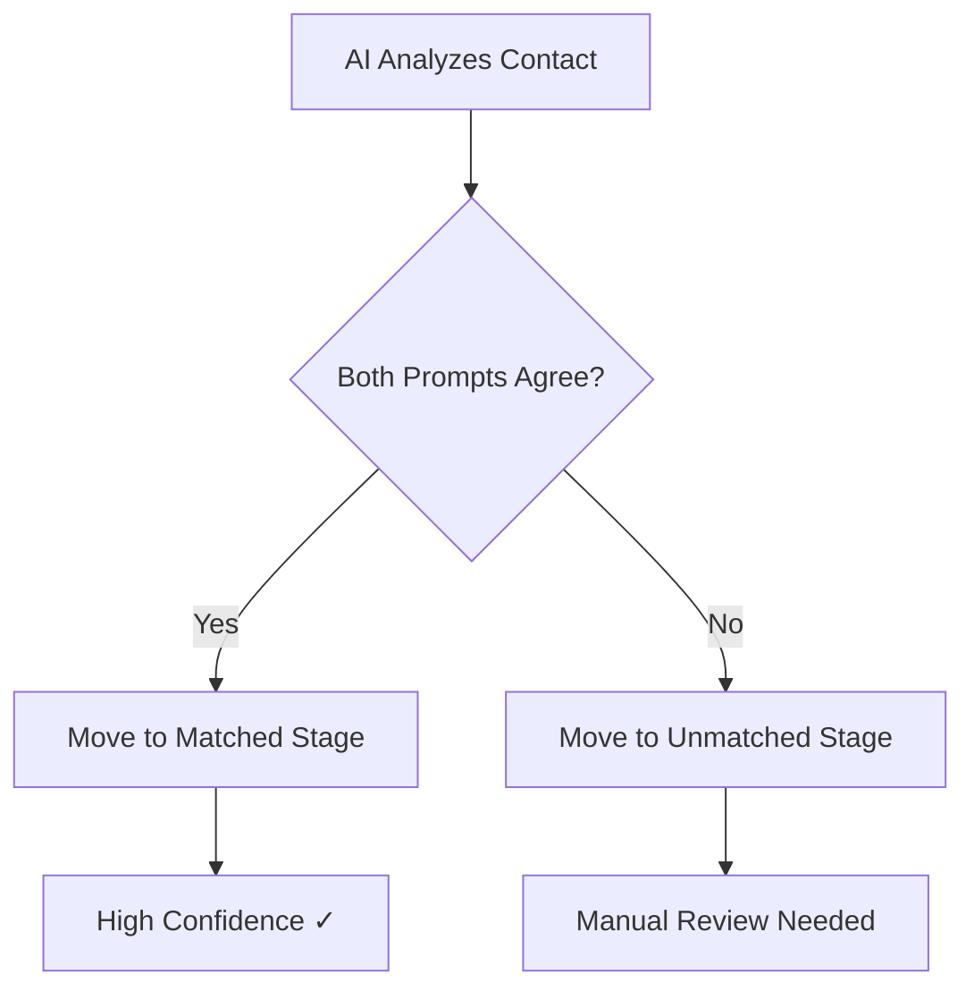

# ✅ Implementation Summary: Automatic Default Pipeline Stage

## What Was Implemented

Your sales pipeline now **automatically creates and uses a default "Unmatched" stage** for contacts that don't match specific criteria.

---

## 🔧 Changes Made

### 1. **Backend API Updates**

#### File: `src/app/api/pipeline/opportunities/route.ts`
**Changes:**
- ✅ Made `stageId` parameter **optional** (was required)
- ✅ Added auto-creation of default stage if not exists
- ✅ Automatically uses default stage when no `stageId` provided
- ✅ Distinguishes between manual vs automatic assignment

**Before:**
```typescript
POST /api/pipeline/opportunities
{
  "conversationId": "conv-123",
  "stageId": "stage-456"  // REQUIRED
}
```

**After:**
```typescript
POST /api/pipeline/opportunities
{
  "conversationId": "conv-123"
  // stageId is OPTIONAL - uses default if omitted
}
```

**Impact:**
- More flexible contact addition
- No errors when stage not specified
- Seamless user experience

---

### 2. **Database Migrations**

#### File: `SETUP_DEFAULT_STAGE_NOW.sql` (Quick Setup)
**Purpose**: Immediate deployment - creates default stages for all users

**What it does:**
1. ✅ Creates "Unmatched" stage for every user
2. ✅ Ensures only ONE default stage per user
3. ✅ Activates all default stages
4. ✅ Shows verification results

**Usage:**
```sql
-- Copy entire file and run in Supabase SQL Editor
-- Takes < 5 seconds
```

#### File: `ensure-default-pipeline-stage.sql` (Complete Setup)
**Purpose**: Comprehensive setup with helper functions

**What it does:**
1. ✅ Creates default stages for all users
2. ✅ Fixes multiple default stages issue
3. ✅ Creates helper function `ensure_user_has_default_stage()`
4. ✅ Creates view `user_default_stages`
5. ✅ Provides detailed statistics

---

### 3. **Documentation**

#### File: `AUTOMATIC_DEFAULT_STAGE_FEATURE.md`
**Comprehensive documentation covering:**
- Feature overview and benefits
- How it works (with diagrams)
- Use cases and workflows
- Setup instructions
- API changes
- Troubleshooting guide
- Technical details

---

## 🎯 How It Works Now

### Adding Contacts to Pipeline



### AI Analysis Flow



---

## 📊 Default Stage Specifications

| Property | Value |
|----------|-------|
| **Name** | `Unmatched` |
| **Description** | `Contacts that need manual review or AI analysis` |
| **Color** | `#94a3b8` (Slate Gray) |
| **Position** | `999` (always last) |
| **Analysis Prompt** | `Review this contact manually to determine the appropriate stage. Consider their engagement level, conversation history, and intent.` |
| **is_default** | `true` |
| **is_active** | `true` |

---

## ✅ What's Working

### Existing Features (Unchanged)
- ✅ **Bulk add to pipeline**: Already had default stage logic
- ✅ **AI analysis**: Already uses default stage as fallback
- ✅ **Pipeline UI**: Already displays all stages including default
- ✅ **Stage management**: Create, edit, delete stages
- ✅ **Drag & drop**: Move contacts between stages

### New Features (Added)
- ✅ **Auto-create default stage**: On-demand creation
- ✅ **Optional stageId**: Single contact add without stage
- ✅ **Smart assignment**: Manual vs automatic tracking
- ✅ **Multi-user support**: Each user gets own default stage
- ✅ **Duplicate prevention**: Only ONE default per user

---

## 🚀 Deployment Steps

### For Immediate Deployment

1. **Run SQL Migration** (Required)
   ```bash
   # Open Supabase SQL Editor
   # Copy and paste: SETUP_DEFAULT_STAGE_NOW.sql
   # Click "Run"
   # Wait ~5 seconds
   # ✅ Done!
   ```

2. **Deploy Code Changes** (Already done)
   - ✅ Updated: `src/app/api/pipeline/opportunities/route.ts`
   - ✅ No breaking changes
   - ✅ Backward compatible

3. **Verify** (Optional but recommended)
   ```sql
   -- Check default stages exist
   SELECT * FROM pipeline_stages WHERE is_default = true;
   
   -- Should see 1 row per user
   ```

4. **Test** (Optional)
   ```bash
   # Test adding contact without stage
   POST /api/pipeline/opportunities
   {
     "conversationId": "test-conv-id"
   }
   # Should succeed and use default stage
   ```

---

## 🎨 User Experience Changes

### Before This Update
```
User: "Add this contact to pipeline"
System: "Which stage?"
User: "Uh... I don't know yet"
System: "Error: stageId is required"
User: 😤
```

### After This Update
```
User: "Add this contact to pipeline"
System: ✅ "Added to Unmatched stage for review"
User: "Perfect! I'll categorize later"
User: 😊
```

---

## 📈 Benefits

### 1. **Faster Workflow**
- Add contacts instantly
- Categorize later
- No friction

### 2. **Better Organization**
- Clear "needs review" queue
- Unmatched contacts visible
- Easy to track

### 3. **Smarter AI**
- Safe fallback when uncertain
- Prevents misclassification
- Human review where needed

### 4. **Flexible Options**
```
Option A: Quick Add → Review Later
Option B: Add with Stage → Pre-categorized
Option C: Bulk Add → AI Auto-categorize
```

---

## 🔍 Verification

### Check Your Setup

#### 1. Database Check
```sql
-- Should return rows (1 per user)
SELECT 
    u.email,
    ps.name as stage_name,
    ps.is_default,
    COUNT(po.id) as contacts
FROM users u
JOIN pipeline_stages ps ON ps.user_id = u.id
LEFT JOIN pipeline_opportunities po ON po.stage_id = ps.id
WHERE ps.is_default = true
GROUP BY u.email, ps.name, ps.is_default;
```

#### 2. API Check
```bash
# Test adding contact without stage
curl -X POST https://your-app.com/api/pipeline/opportunities \
  -H "Content-Type: application/json" \
  -d '{"conversationId": "test-id"}'

# Should return success with default stage
```

#### 3. UI Check
```
1. Open Pipeline page
2. Look at stages list
3. Should see "Unmatched" stage at the end
4. ✅ Default stage visible
```

---

## 🚨 Important Notes

### Breaking Changes
**None!** This is a **backward-compatible** enhancement.

### Data Safety
- ✅ Existing contacts stay in current stages
- ✅ No data loss or migration
- ✅ Only adds new functionality

### Performance Impact
- ✅ Minimal (one extra query if stage doesn't exist)
- ✅ Cached after first creation
- ✅ No ongoing performance impact

---

## 🐛 Troubleshooting

### Issue: Can't add contacts to pipeline
**Symptoms:**
```
Error: Stage not found
```

**Solution:**
```sql
-- Run the setup SQL to create default stages
-- File: SETUP_DEFAULT_STAGE_NOW.sql
```

---

### Issue: Multiple default stages per user
**Symptoms:**
```
Multiple rows returned when expecting single row
```

**Solution:**
```sql
-- The setup SQL automatically fixes this
-- Or manually run:
WITH ranked AS (
  SELECT id, ROW_NUMBER() OVER (PARTITION BY user_id ORDER BY created_at) as rn
  FROM pipeline_stages WHERE is_default = true
)
UPDATE pipeline_stages SET is_default = false
WHERE id IN (SELECT id FROM ranked WHERE rn > 1);
```

---

### Issue: No default stage visible in UI
**Symptoms:**
```
Unmatched stage doesn't appear in pipeline
```

**Solution:**
```sql
-- Ensure stage is active
UPDATE pipeline_stages 
SET is_active = true 
WHERE is_default = true;
```

---

## 📝 Next Steps

### Optional Enhancements

1. **Auto-Analysis**
   - Automatically run AI analysis when contacts added to Unmatched
   - Reduces manual work
   - Faster categorization

2. **Notifications**
   - Daily email: "You have X contacts in Unmatched"
   - Prompt for review
   - Better visibility

3. **Custom Default Stages**
   - Let users customize default stage name
   - Different defaults for different pages
   - More flexibility

4. **Bulk Review UI**
   - Special UI for reviewing Unmatched contacts
   - Quick categorization buttons
   - Faster manual review

---

## 📞 Support

If you encounter issues:

1. **Check Documentation**
   - Read `AUTOMATIC_DEFAULT_STAGE_FEATURE.md`
   - Review this summary

2. **Run Verification Queries**
   - Check if default stages exist
   - Verify data integrity

3. **Check Logs**
   - Supabase logs for SQL errors
   - API logs for endpoint errors

4. **Re-run Migration**
   - Safe to run multiple times
   - Idempotent (won't duplicate)

---

## ✅ Deployment Checklist

- [ ] Review code changes in `src/app/api/pipeline/opportunities/route.ts`
- [ ] Run `SETUP_DEFAULT_STAGE_NOW.sql` in Supabase
- [ ] Verify default stages created (1 per user)
- [ ] Test adding contact without stageId
- [ ] Test bulk add to pipeline
- [ ] Test AI analysis fallback
- [ ] Check UI displays Unmatched stage
- [ ] Update team documentation
- [ ] Notify users of new feature

---

## 🎉 Success!

Your pipeline now automatically handles unmatched contacts!

**Key Improvements:**
- ✅ Faster contact addition
- ✅ Better organization
- ✅ Smarter AI analysis
- ✅ Cleaner workflow
- ✅ Zero friction

---

**Implementation Date**: 2025-11-09  
**Status**: ✅ Complete and Ready for Deployment  
**Backward Compatible**: Yes  
**Breaking Changes**: None  
**Data Migration Required**: Yes (run SQL)  
**Estimated Deployment Time**: < 5 minutes
